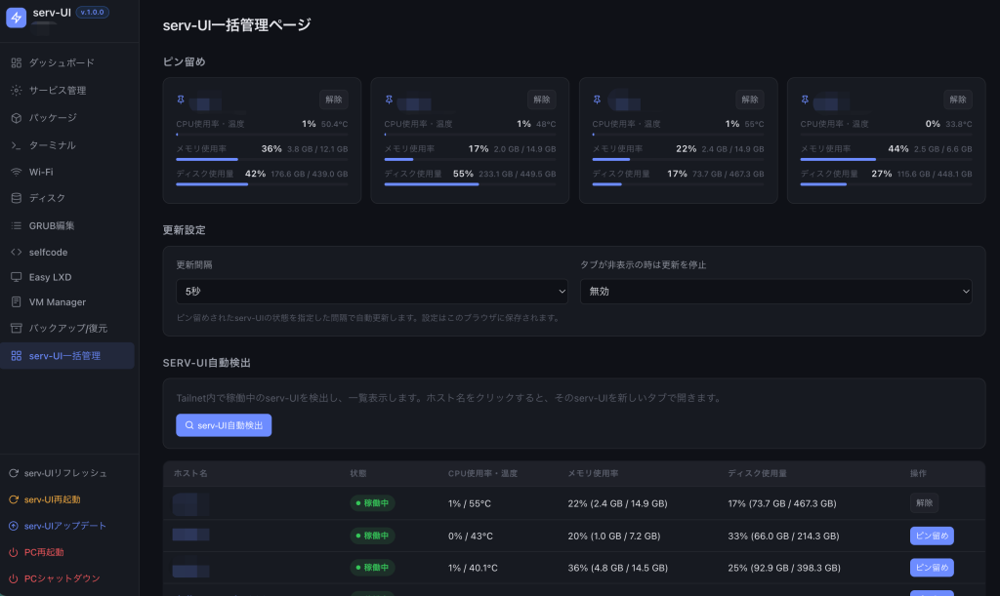

# serv-UI

Webベースのサーバー管理ツール。Tailscale内のHTTPS経由でアクセス可能。

## 機能

| 機能 | 説明 |
|------|------|
| ダッシュボード | CPU・温度・メモリ・ディスク使用率、トッププロセス、システム情報を表示 |
| サービス管理 | systemdサービスの起動・停止・再起動・ステータス確認 |
| パッケージ管理 | aptアップデート確認・一括更新・個別更新・依存関係の修復 |
| ターミナル | ブラウザ上のWebターミナル (ユーザーアカウントで~に接続) |
| Wi-Fi管理 | 周囲のWi-Fiスキャン・接続・切断・設定管理 |
| ディスク管理 | パーティションのマウント（一時/永続）・作成・拡張・削除、LVM (VG/LV) の作成・リサイズ・削除 |
| GRUB編集 | GRUBエントリーの一覧・削除、ISOループブートエントリーの追加、次回起動時のみGRUBメニューを表示 |
| selfcode / Easy LXD / VM Manager | 連携アプリの導入と起動。未インストールの場合は確認ダイアログ表示後にターミナルでインストール、インストール済みならサイトを新しいタブで開く |
| バックアップ/復元 | Clonezilla (cloneauto) によるパーティション単位のバックアップ・復元 |
| システム操作 | serv-UIの再起動・アップデート、PC本体の再起動・シャットダウン |



### バックアップ/復元について

[cloneauto](https://github.com/hirogura/cloneauto) を利用したClonezilla連携機能です。

- **パーティションのみ対応**（LVMは非対応）
- 事前に**保存用パーティション**を用意し、**`/iso` にマウント**しておく必要があります
- 「Clonezillaをインストール」ボタンでGitHubからcloneautoを取得し、Clonezilla Live・ヘルパーコマンド (`sudo clonezilla-backup` / `sudo clonezilla-restore`)・GRUBメニューをインストールします
- バックアップ/復元を実行すると自動的に再起動し、Clonezilla Liveが処理を行います（完了後も自動で再起動します）
- 復元では保存先パーティション内のバックアップイメージを選択できます

## インストール

### 前提条件

- Ubuntu Server (20.04+)
- Tailscale がインストール済み

```bash
# Tailscale インストール (未インストールの場合)
curl -fsSL https://tailscale.com/install.sh | sh

# Tailscale 接続
tailscale up
```
### Ubuntu 26.04 Serverインストール直後なら下記でアップデートやTailscale、serv-UIまで一気に（推奨）

```bash
wget -qO ubsv.sh https://raw.githubusercontent.com/hirogura/servui/main/ubsv.sh
bash ubsv.sh
```

### 自動インストール (通常)

```bash
git clone https://github.com/hirogura/servui.git
cd servui
sudo bash setup.sh
```

オプション:

```bash
sudo bash setup.sh --branch test    # 指定ブランチからインストール (デフォルト: main)
sudo bash setup.sh --no-restart     # デプロイのみ行い、再起動は手動で実施
```

スクリプトは以下を自動で実行します:

1. Python 3 と依存パッケージのインストール
2. `servui` ユーザーの作成
3. sudoers の設定 (systemctl/aptコマンドをパスワードなしで実行可能)
4. GitHub からリポジトリをクローンして `/opt/servui` にデプロイ
5. systemd サービスの作成・起動
6. `tailscale serve` の設定 (HTTPS:3355)

### アクセス

Tailscale ネットワーク内のブラウザから:

```
https://YOUR-TAILSCALE-HOSTNAME:3355
```

※LANからはアクセス不可。Tailscale内からのみアクセス可能。

## アンインストール

```bash
git clone https://github.com/hirogura/servui.git
cd servui
sudo bash uninstall.sh
```

以下のものが削除されます:

- systemd サービス (servui.service)
- sudoers 設定 (/etc/sudoers.d/servui-systemctl)
- アプリケーション (/opt/servui)
- servui ユーザー
- Tailscale serve 設定 (HTTPS:3355)

## サービス管理

```bash
# ステータス
systemctl status servui

# 再起動
sudo systemctl restart servui

# ログ
journalctl -u servui -f

# 停止
sudo systemctl stop servui
```

## セキュリティ

- ポート3355は**Tailscale内のみ**で公開
- LANからはアクセス不可 (`tailscale serve` が外部リクエストを拒否)
- `servui` ユーザーによる権限分離と sudoers によるコマンド制御


## アーキテクチャ

```
[ブラウザ (Tailscale内)]
    │
    ▼ HTTPS:3355
[Tailscale Serve] ← TLS終端
    │
    ▼ HTTP:127.0.0.1:3355
[FastAPI (serv-UI)]
    │
    ├── psutil (システム情報)
    ├── systemctl (サービス管理)
    ├── apt (パッケージ管理)
    ├── lsblk / mount / LVM (ディスク管理)
    ├── grub関連ファイル (GRUB編集)
    ├── cloneauto / Clonezilla Live (バックアップ/復元)
    └── WebSocket (ターミナル)
```

## 開発

```bash
git clone https://github.com/hirogura/servui.git
cd servui
python3 -m venv venv
source venv/bin/activate
pip install -r requirements.txt
uvicorn main:app --host 127.0.0.1 --port 3355 --reload
```

## License

[MIT](LICENSE)
